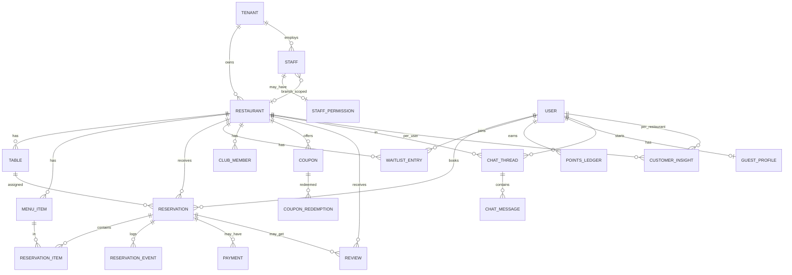

# DATABASE.md — RezervoNo

> Source of truth: `api/prisma/schema.prisma` (37 models, 17 enums) +
> `api/prisma/migrations/`. Column names shown are the DB (`@map`) names.

---

## 1. Overview

- **Engine**: PostgreSQL — self-hosted `postgres:16-alpine` in the canonical
  docker-compose deployment (`docker-compose.yml:12`). *(Corrected 2026-08-27: this
  line previously claimed a Supabase-hosted production DB; the repo has no Supabase code,
  env, or `directUrl` — Supabase appears only in comments about managed-PG
  connection limits.)*
- **ORM**: Prisma (`prisma-client-js`).
- **IDs**: `uuid` PKs — client-generated `@default(uuid())` for most models;
  `@default(dbgenerated("gen_random_uuid()"))` where raw-SQL backfills need a DB
  default (economy ledger `075`, `menu_categories` `077`) — except natural keys (`otp_codes.phone`,
  `idempotency_keys.key`, `platform_settings.key`, `club_code_counters`,
  composite keys on join/insight tables).
- **Naming**: `snake_case` columns via `@map`, `camelCase` in TS.
- **Enums** are DB enums (not strings) for status/role/plan/segment fields.

---

## 2. ER Diagram (core)

> The diagram shows the **core** relationships. Peripheral tables
> (`special_events`, `restaurant_photos`, `staff_notes`, `campaign_logs`,
> `sms_transactions`, `webhooks`, `restaurant_closures`, `referrals`,
> `gift_cards`, `marketing_automations`, `club_code_counters`) all hang off
> `restaurant` and/or `user`.

---

## 3. Tables (models)

### Tenancy & identity
| Model / table | Key fields | Notes |
|---|---|---|
| `Tenant` / `tenants` | `plan` (SubscriptionPlan), `planExpiresAt`, `trialEndsAt`, **`version`** | `version` = optimistic lock (prevents lost updates). |
| `User` / `users` | `phone` (unique), `email?`, `referralCode?`, `referredById?` | Diner identity; `guestProfile` 1:1. |
| `Staff` / `staff` | `tenantId`, `phone`, `name?`, `role` (StaffRole), `isActive`, `restaurantId?` | `name` is the optional display name (business panel). `restaurantId=NULL` → all-branch access; set → locked to one branch. Unique `(tenantId, phone)`. |
| `StaffPermission` / `staff_permissions` | 9 `can*` booleans | Modular RBAC override for `role='staff'`. |

### Restaurant & inventory
| Model / table | Key fields | Notes |
|---|---|---|
| `Restaurant` / `restaurants` | `slug` (unique), scheduling config (`slotMinutes`, `bufferMinutes`, `cleaningMinutes`, `lateGraceMinutes`, `holdMinutes`), cashback pcts, `openingHours` (Json), `pricingRules` (Json), `smsBalance`, `paymentEnabled`, `onlineGating`, `lastSeenAt` (heartbeat) | Central entity. |
| `Table` / `tables` | `number`, `capacity`, `min/maxPartySize`, `shape`, `zone`, VIP/smoking/accessible flags, merge/split, `state` (TableState), `qrCode?` | Unique `(restaurantId, number)`. |
| `MenuItem` / `menu_items` | `priceToman`, `soldCount` | |
| `SpecialEvent` / `special_events` | `startsAt`, `priceToman?`, `capacity?` | Public events feed. |
| `RestaurantPhoto` / `restaurant_photos` | `url`, `category`, `sortOrder`, `status`, `storageKey`, `width`/`height`, `rejectionReason` | Gallery with moderation. `status` (`photo_status` enum: pending/approved/rejected) gates public visibility — only `approved` is exposed by `/v1/restaurants/[slug]`. `storageKey` points at a file on the `uploads` volume; the bytes are **not** in Postgres, so back up that volume too. Unique partial index on `storage_key` prevents two rows sharing one file. |
| `RestaurantClosure` / `restaurant_closures` | PK `(restaurantId, closureDate)` | Manual day closures. |

### Reservations
| Model / table | Key fields | Notes |
|---|---|---|
| `Reservation` / `reservations` | `code` (unique), `status` (ReservationStatus, 18 values), `slotStart/End`, `partySize`, `holdExpiresAt`, `mergedTableNumbers`, `depositStatus`, no-show risk fields | Heart of the system. Many composite indexes. |
| `ReservationItem` / `reservation_items` | PK `(reservationId, menuItemId)`, `qty` | Pre-order lines. `onDelete: Cascade` from reservation, `Restrict` from menu item. |
| `ReservationEvent` / `reservation_events` | `fromStatus`, `toStatus`, `actor`, `isAutomatic` | Per-reservation audit log of status transitions. |
| `Payment` / `payments` | `provider` (zarinpal), `authority?` (unique), `refId?`, `amountToman`, `status` (PaymentStatus) | One reservation → many payment attempts. |

### Waitlist & loyalty
| Model / table | Key fields | Notes |
|---|---|---|
| `WaitlistEntry` / `waitlist_entries` | `status` (WaitlistStatus), `priority`, `isVip`, offer timers, `estimatedWaitMinutes` | Priority queue. |
| `PointsLedger` / `points_ledger` | `delta`, `reason` (PointsReason) | Append-only points history. |
| `Referral` / `referrals` | `inviteePhone`, `status`, `rewardPoints` | |
| `GiftCard` / `gift_cards` | `code` (unique), `amountToman`, `balanceToman`, `status` | Partial redemption supported. |
| `ClubMember` / `club_members` | `code`, `tier`, `points` | Unique `(restaurantId, userId)` and `(restaurantId, code)`. |
| `ClubCodeCounter` / `club_code_counters` | `nextValue` | Per-restaurant club code sequence. |

### CRM / intelligence
| Model / table | Key fields | Notes |
|---|---|---|
| `CustomerInsight` / `customer_insights` | PK `(restaurantId, userId)`; CLV, RFM (`r/f/mScore`, `rfmSegment`), `churnRiskScore`, `segment` (CustomerSegment) | Per (restaurant × user), updated by nightly cron + after each completed/no-show. |
| `GuestProfile` / `guest_profiles` | PK `userId`; global CLV, `restaurantsVisited`, `dietaryTags` | Cross-restaurant aggregate. |
| `Coupon` / `coupons` | `kind` (CouponKind), `value`, limits, `targetSegment?` | Unique `(restaurantId, code)`. |
| `CouponRedemption` / `coupon_redemptions` | `discountToman`, `ip` | Fraud detection uses `ip`. |
| `MarketingAutomation` / `marketing_automations` | `trigger` (AutomationTrigger), `triggerConfig` (Json), `couponId?` | Event-based campaigns. |
| `Review` / `reviews` | `rating`, sub-ratings, `reply` | Linked to reservation. |
| `StaffNote` / `staff_notes`, `CampaignLog` / `campaign_logs`, `SmsTransaction` / `sms_transactions` | — | Ops/marketing history + SMS balance ledger. `campaign_logs` is one row **per campaign**; `outreach_log` (below) is one row **per recipient** — different grain, not duplication. |

### ML / measurement (migrations 033, 034, 042, 055–057)

> **Added 2026-08-20.** This whole section was missing: the tables existed but no
> document outside `docs/ML_CONTRACT.md` mentioned them. **Read
> `docs/ML_CONTRACT.md` before touching any of these** — it is the binding contract.

| Model / table | Key fields | Notes |
|---|---|---|
| `RestaurantNoShowModel` / `restaurant_no_show_models` | `weights`, `learnedBrier`, `staticBrier`, `isActive`, `activeRunId?` | Per-tenant learned model. Stays inactive unless it beats the heuristic on a **temporal** holdout. |
| `RestaurantDemandForecast` / `restaurant_demand_forecasts` | Holt-Winters params, holdout MAE | Same activation discipline as above. |
| `ModelTrainingRun` / `model_training_runs` | `kind`, `sampleSize`, `metrics` (Json), `isActive`, `reason` | **Append-only** version ledger — never rewrite a historical run. |
| `ModelPrediction` / `model_predictions` | `predictionType`, `entityType`/`entityId`, `modelSource`, `modelRunId?`, `featureVersion`, `predictedValue`, `confidence` | Immutable record of what was predicted in production. `confidence` may be `insufficient_data`. |
| `ModelOutcome` / `model_outcomes` | `observedValue`, `squaredError` (Brier), `absoluteError` (MAE), unique `(predictionId, source)` | Observation, deliberately a separate table from the prediction. |
| `OutreachLog` / `outreach_log` | `channel`, `source`, `sourceId?`, `sentAt`, `convertedReservationId?` (**UNIQUE**), `convertedAt?`, `resolvedAt?` | One row per contacted recipient. The UNIQUE constraint enforces last-touch attribution at the DB level: a reservation can convert **at most one** outreach. `userId` NULL = raw phone, *unattributable* (excluded from both sides of the rate). |

⚠️ **`outreach_log` is NOT part of the prediction ledger chain.** It sits in this
section because it is *measurement*, but it has **zero** foreign keys to
`model_predictions` / `model_outcomes` / `model_training_runs` (verify:
`grep -c model_ api/prisma/sql/057-outreach-ledger.sql` → `0`). Two independent
feedback loops that happen to share a design philosophy:

| Loop | Question it answers | Tables |
|---|---|---|
| Prediction ledger | "we predicted X — did X happen?" | `model_predictions` → `model_outcomes` |
| Outreach ledger | "we contacted someone — did they book?" | `outreach_log` (self-contained; converts against `reservations`) |

*(Added after an automated reviewer read this grouping and invented an
`outreach_log ─ model_outcomes` relationship that does not exist.)*

⚠️ `marketing_automations.converted_count` is a **dead column** — it was never
incremented anywhere and the panel showed a permanently-zero "conversion rate" from
it. Conversion is now computed from `outreach_log`. The column was deliberately
**not dropped** (dropping breaks `0_init` and every live DB); it is simply no longer
read. See migration `057` and `docs/ML_CONTRACT.md`.

### Platform / infra
| Model / table | Key fields | Notes |
|---|---|---|
| `OtpCode` / `otp_codes` | PK `phone`, `codeHash`, `expiresAt`, `attempts` | SHA-256(code + JWT_SECRET), 2-min TTL, max 5 attempts. |
| `AuditLog` / `audit_logs` | `action`, `actorType`, `success`, `detail` (Json), `traceId` | Security/governance events. |
| `Job` / `jobs` | `kind`, `payload`, `priority`, `status` (JobStatus), `idempotencyKey?` (unique), `attempts`, `runAfter` | Postgres job queue (SKIP LOCKED). |
| `IdempotencyKey` / `idempotency_keys` | PK `key`, `scope`, `response?`, `status` | HTTP-level double-submit protection. |
| `Webhook` / `webhooks` | `url`, `events`, `secret?` | Outbound integrations (HMAC signed). |
| `PlatformSettings` / `platform_settings` | PK `key`, `value` | Runtime settings (e.g. Zarinpal merchant id), ~30s cached. |
| `ChatThread` / `chat_threads`, `ChatMessage` / `chat_messages` | polling-based | User ↔ restaurant chat; thread optionally linked to a reservation. |

### Enums (17)
`SubscriptionPlan`, `StaffRole`, `TableShape`, `TableZone`, `TableState`,
`ReservationStatus`, `DepositStatus`, `PaymentStatus`, `WaitlistStatus`,
`PointsReason`, `ReferralStatus`, `GiftCardStatus`, `CustomerSegment`,
`CouponKind`, `AutomationTrigger`, `JobStatus`, `ChatSender`.

---

## 4. Relationships (highlights)

- `Tenant 1—N Restaurant`, `Tenant 1—N Staff`.
- `Restaurant 1—N` almost everything operational (tables, reservations,
  waitlist, coupons, reviews, chats, …).
- `Reservation N—1 Restaurant`, `N—1 Table?`, `N—1 User?` (guest reservations
  have `userId=NULL` + `guestName/guestPhone`).
- `CustomerInsight` is a composite `(restaurant × user)` junction with metrics.
- Cascade deletes: `reservation_items`, `reservation_events`, `chat_*`,
  `webhooks`, `sms_transactions`, `restaurant_closures`, `guest_profiles`
  cascade from their parent; `reservation_items → menu_item` is `Restrict`
  (protects order history integrity).

---

## 5. Migrations

Two layers (both applied in CI):

1. **`prisma/migrations/0_init`** — the baseline Prisma migration
   (`migration.sql`). Applied by `prisma migrate deploy`.
2. **`prisma/sql/*.sql`** — hand-written SQL scripts (`001` … `077`, see the
   files themselves for the live list) for things
   Prisma can't express: partitioning, exclusion constraints, partial unique
   indexes, RLS, expression indexes, FK/index back-fills. These are **not**
   Prisma migrations — they live outside `migrations/` (so they never trip
   `migrate deploy` with P3015) and are applied by `prisma/apply-sql.sh`, which
   iterates the folder with `prisma db execute` and skips files marked
   `-- @manual-only` (the partitioning guides `002`/`011`). The canonical
   `block_end` column + `no_table_overlap` EXCLUDE constraint now live in
   `026-consolidate-exclusion-constraint.sql` (idempotent; it replaced the old
   `0_init/EXTRA-after-prisma-migrate.sql`).

| Notable manual migration | Purpose |
|---|---|
| `001-performance-indexes` | Query indexes for scale. |
| `011-reservations-partitioning` | Partition `reservations`. |
| `013-money-concurrency-fixes` | Money/concurrency correctness. |
| `016-exclude-constraint-active-statuses` | **Exclusion constraint** = double-booking source of truth. |
| `018-staff-branch-scoping` | Per-branch staff scoping. |
| `019-payments-deposit`, `020-platform-settings-payment-toggle` | Zarinpal deposits + runtime settings. |
| `021-restaurant-closures`, `024-chat`, `025-reviews-fk-indexes` | Later features + index back-fills. |
| `021b-sms-transactions-table` | Creates `sms_transactions` — a table `schema.prisma` declares but no script built (only `db push` did). Idempotent; runs before `022`'s FK. |
| `022-audit-fixes-2026-07-19` | Reconciled DB↔schema drift (FKs/`@map` that existed only in the live DB). |
| `037-rls-core-tables` | Row-Level Security on the core tenant tables. |
| `038-unified-economy` | XP/points economy ledger + customer economy profile. |
| `044-waitlist-guest-token-hash` | Hash guest access tokens at rest. |
| `054-index-hygiene` | Dropped redundant / added missing indexes. |
| `055-prediction-outcome-ledger` | `model_predictions` + `model_outcomes` — "what we predicted, then what happened". |
| `056-model-registry-active-run` | Pins each prediction to the model version that made it. |
| `057-outreach-ledger` | `outreach_log` — per-recipient marketing/CRM contact record with measured conversion. |

> ⚠️ **Corrected 2026-08-20:** this section previously said the scripts ran `001 … 028`
> and the table above stopped at `022`. Both were ~30 migrations behind. The table is
> deliberately a **selection of notable ones**, not a full index — the files themselves
> (each with a detailed Persian header) are the source of truth. See
> `api/prisma/sql/README.md`.

> ⚠️ **Also corrected 2026-08-20:** the text above says these scripts "are applied by
> `prisma/apply-sql.sh`". True, but incomplete in a way that matters: production runs
> **both** steps — `prisma migrate deploy` (for `0_init`) *and then* `apply-sql.sh`
> (see `api/docker-entrypoint.sh` lines 39 and 54). `apply-sql.sh` alone cannot build a
> schema from an empty database, because migration `001` assumes the base tables exist.
> `tools/check-schema-drift.sh` gates exactly this two-step path in CI.
| `023-rls-new-tables` | Row-Level Security for new tables. |
| `026-consolidate-exclusion-constraint` | Canonical `block_end` + `no_table_overlap` (idempotent); replaced `0_init/EXTRA`. |
| `027-staff-name` | Adds `staff.name` (business-panel display name). |
| `028-enum-columns-staff-plan` | Upgrades `staff.role` and `tenants.plan` from `TEXT` to their enums (`staff_role`, `subscription_plan`). Same schema-vs-`migrate deploy` drift family as `021b`/`sms_transactions`: `0_init` builds them as `TEXT` but `schema.prisma` declares enums. **No-op on the live DB** (already enum via `db push`); only realigns a fresh Docker install. |
| `029-platform-events` · `059b-telemetry-trust-boundary` · `060-platform-events-retention` | Behavioural-event ingest, its **trust-level CHECK** (`SERVER_VERIFIED`…`SYNTHETIC`) and retention pruning. |
| `033-no-show-model` · `034-demand-forecast` · `042-model-training-runs` | Learned models plus the **append-only** `model_training_runs` history (metrics, sample size, activation decision). |
| `037-rls-core-tables` | Row-Level Security on core tables (extends `023`). |
| `038-unified-economy` · `040-user-badges` · `043-customer-intelligence-score` | Coins/XP ledger, badges, weighted customer score. |
| `041-waitlist-guest-token` → `044-waitlist-guest-token-hash` | Guest access token for waitlist actions, later stored **hashed** (compared timing-safe). |
| `061-drop-duplicate-indexes` · `062-hot-path-indexes` | Removed 45 duplicate index pairs (two DDL sources built the same index under different names), then added the two indexes real hot paths needed. |
| `063-notification-consent` | `users.notification_prefs jsonb` — per-category consent. Absent key = "no opinion" (keeps existing delivery); only an explicit `false` opts out. Enforced in `POST /restaurant/sms`. |
| `064-nonnegative-balance-checks` | `CHECK (… >= 0)` on `wallet_balance`, `gift_cards.balance_toman`, `restaurants.sms_balance`, `club_members.points`. The app already guards these with conditional `UPDATE … WHERE balance >= amount`; this is the DB-level backstop so a future code path can't silently create negative money. |

> **Important operational note:** the hand-written SQL scripts were previously
> under `prisma/migrations/manual/`, which made `prisma migrate deploy` fail with
> P3015 (a folder inside `migrations/` with no `migration.sql`). They now live in
> `prisma/sql/` — outside `migrations/` — so `migrate deploy` runs cleanly. Both
> the Docker entrypoint and CI apply them the same way: `migrate deploy`, then
> `prisma/apply-sql.sh` (which uses `prisma db execute`, since the runtime image
> has no `psql`). The entrypoint also baselines a pre-existing database with
> `prisma migrate resolve --applied 0_init` to avoid P3005.

---

## 6. Indexes

Indexes are defined inline in `schema.prisma` (`@@index`) plus additional ones in
`prisma/sql/001` and elsewhere. High-value composite indexes on `reservations`:

- `(restaurantId, status, slotStart)` — restaurant dashboard.
- `(tableId, status, slotStart, slotEnd)` — table-conflict / availability.
- `(userId, slotStart DESC)` — user history.
- `(status, holdExpiresAt)` — expiring hold cleanup.
- `(restaurantId, createdAt)` and `(restaurantId, noShowRiskTier, slotStart)`.

Other notable indexes: `waitlist_entries(restaurantId, status, priority DESC,
joinedAt)`, `jobs(status, priority, runAfter)`, `audit_logs(action, createdAt)`,
`customer_insights(restaurantId, segment, predictedClvToman DESC)`.

---

## 7. Constraints

- **Unique**: `users.phone`, `users.email`, `users.referralCode`,
  `restaurants.slug`, `staff (tenantId, phone)`, `tables (restaurantId, number)`,
  `reservations.code`, `payments.authority`, `coupons (restaurantId, code)`,
  `club_members` (two uniques), `jobs.idempotencyKey`.
- **Exclusion constraint** (manual `016`): prevents overlapping active
  reservations on the same table — the definitive anti-double-booking guard.
- **Partial unique indexes** (manual): e.g. yearly birthday/anniversary points
  (migration `013`), and the single "general" chat thread per (user,restaurant)
  where `reservationId IS NULL` (migration `024`) — Prisma can't express these,
  hence the raw SQL.
- **Optimistic locking**: `Tenant.version`.

---

## 8. Transaction Strategy

- Prisma `$transaction` is used across money/state-critical paths:
  `reservations.ts` (5), `waitlist.ts` (4), `loyalty.ts` (2), `coupons.ts` (2),
  `sms-balance.ts` (2), `chat.ts` (2), `lifecycle.ts` (1).
- The reservation engine combines **Redis slot-locks** (`withSlotLock`) with DB
  transactions and retries **serialization/conflict errors**
  (`isSerializationError`, `isConflictError` → `CONCURRENCY_RETRY`).
- **HTTP idempotency**: the `idempotency_keys` table caches the first successful
  response for a scope (e.g. `reservation`) so a retried `POST` (via the
  `Idempotency-Key` header) is not double-processed.

---

## 9. Soft-Delete Strategy

There is **no global soft-delete column**. Instead:

- "Deletion" is generally modeled as **status/flag changes**: `Reservation.status`
  (`cancelled`/`no_show`/`expired`/…), `isActive` flags (`Table`, `MenuItem`,
  `Coupon`, `SpecialEvent.isPublished`, `Staff.isActive`), `Restaurant.isOpen`.
- A few endpoints do hard-`DELETE` peripheral rows (e.g. `restaurant/tables/[id]`,
  `restaurant/notes`, `restaurant/photos`, `restaurant/events`).
- History tables (`reservation_events`, `points_ledger`, `sms_transactions`,
  `audit_logs`, `campaign_logs`) are append-only.

> **(uncertain)**: there is no repo-wide convention doc for soft-delete; the
> above is inferred from the schema and route handlers.

---

## 10. Future Migration Notes

- **Optionally fold `prisma/sql/*.sql` into first-class migrations.** The P3015
  blocker is gone (they no longer sit inside `migrations/`), and both Docker and
  CI apply them via `prisma/apply-sql.sh`. Every new script **must be committed
  the moment it is applied** (past drift caused the `022` reconciliation).
- **RLS** exists for newer tables (`023`); ensure new tables also get RLS.
- **Partitioning is not enabled.** `011` is a `-- @manual-only` scaffold (guarded
  by `RAISE EXCEPTION`, with the data-copy/rename steps commented out) and has
  never been applied — `reservations` is a plain table (`relkind='r'`) on
  production, and `POST /v1/maintenance/ensure-partitions` returns
  `{ok:false, reason:'partitioning not enabled'}` because
  `ensure_reservation_partition` does not exist. It is a future scale option, not
  a live requirement; a skipped cron run does not break inserts.
- Keep `schema.prisma` in sync with the live DB — the `⚠️ همگام‌سازی‌شده`
  comments mark fields that previously existed only in the DB.

## SPEC-A فاز ۱ (migration 077) — منوی دسته‌بندی‌شده

- **`menu_categories`**: دسته‌ی رابطه‌ایِ منو (`@@unique([restaurantId, name])`،
  ترتیبِ `sort_order`، حذفِ نرم با `is_active=false`). PK با
  `dbgenerated("gen_random_uuid()")` چون backfillِ ۰۷۷ با INSERT خام ردیف می‌سازد.
- **`menu_items.category_id`** (FK با `ON DELETE SET NULL`) و
  **`menu_items.is_out_of_stock`** (برچسبِ «ناموجود» — آیتم مخفی نمی‌شود).
- ستونِ متنیِ `menu_items.category` **میرورِ سازگاری** است: منبعِ حقیقت رابطه است
  و سرور در هر تغییرِ دسته (ستِ آیتم، renameِ دسته، متنِ آزادِ کلاینتِ قدیمی →
  find-or-create) رشته را سینک می‌کند تا مصرف‌کننده‌های موجود (SEO/مشتری/پنل) نشکنند.
- backfillِ ۰۷۷ دوباراجرایی‌پذیر است: رشته‌های distinct → ردیفِ دسته
  (`ON CONFLICT DO NOTHING`) → لینکِ `category_id` فقط روی NULLها.
- کش: `cache:restaurant-public-menu:{slug}` (TTL ۶۰s) + `restaurant-detail` — از ۰۷۷
  هر mutation منو (آیتم/دسته/reorder/عکس) هر دو را از طریقِ
  `lib/menu-cache.ts:invalidatePublicMenu` باطل می‌کند.

## SPEC-B (migration 076) — provisioning و دعوتِ owner

- `restaurants.provision_status` (enum `restaurant_provision_status`:
  `PENDING_ACTIVATION|ACTIVE|SUSPENDED|OFFBOARDED`). DEFAULT عمداً `ACTIVE`
  است تا ردیف‌های موجود «در انتظار» نشوند؛ مسیرِ provision صریح PENDING
  می‌نویسد و اولین ورودِ موفقِ owner (هوک در verify/login) ACTIVE می‌کند.
- `tenants.branch_limit` — سقفِ شعبه، سطحِ تنانت.
- جدولِ **`staff_invites`** (نامِ جمع طبق قراردادِ repo): `token` یکتای ۶۴هگزی
  (شناسه‌ی لینک، **نه** احرازِ هویت)، `status` enum، `expires_at` (۷۲h)،
  سه FK با `ON DELETE CASCADE ON UPDATE CASCADE` (بندِ ON UPDATE عمدی است —
  گاردِ drift بدونش قرمز می‌شود، درسِ ۰۶۵). منطق: `api/src/lib/provisioning.ts`.
