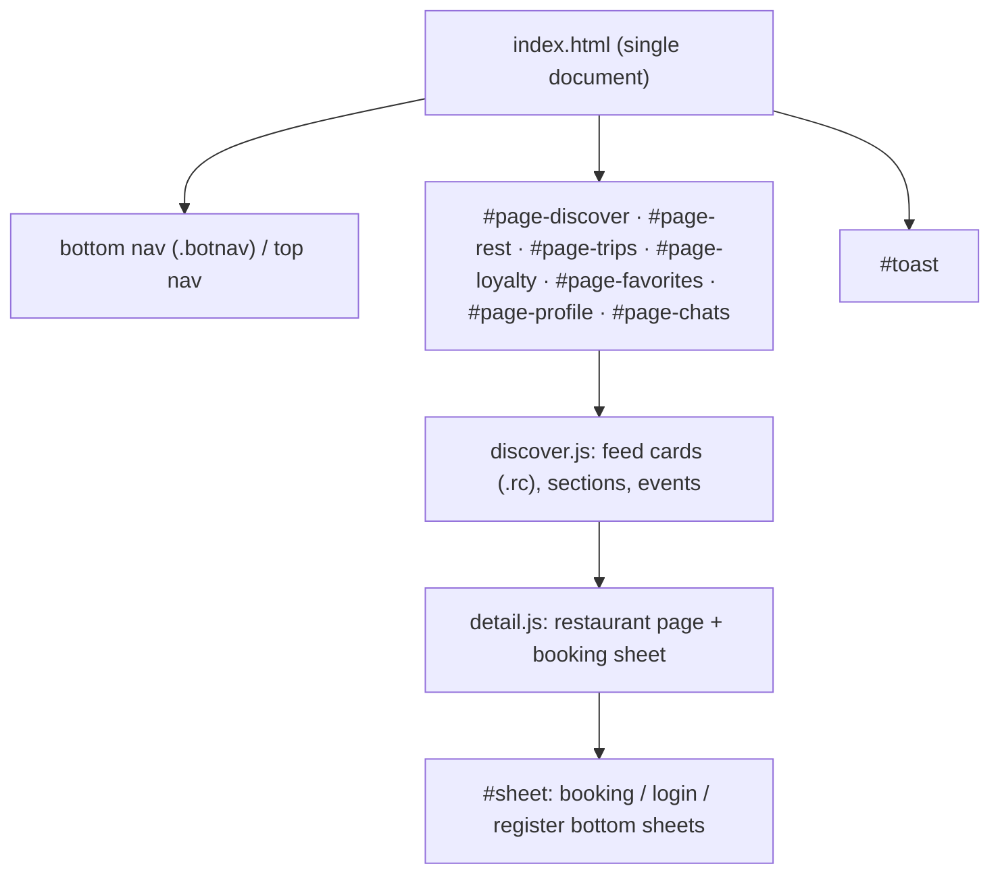
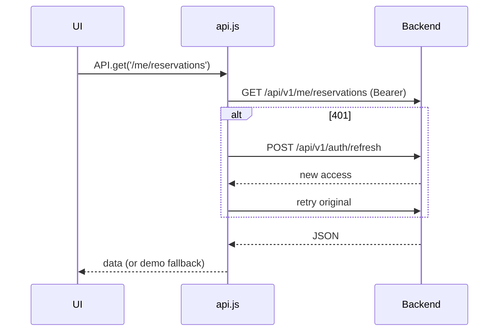

# FRONTEND.md — RezervoNo

> Three static, framework-less front-ends under `apps/`. No bundler, no
> transpile step — browsers load ES modules directly. The design system lives in
> `shared/` and is copied into each app.

---

## 1. Folder Structure

```
apps/
├── customer/                 # Diner PWA
│   ├── index.html
│   ├── manifest.webmanifest, sw.js, favicon.svg, robots.txt, sitemap.xml
│   ├── css/  tokens.css · foundation.css · ds-bridge.css · app.css
│   └── js/
│       ├── init.js           # bootstrap (boot on DOMContentLoaded / deferred)
│       ├── main.js           # feature wiring
│       ├── actions.js        # global event delegation
│       ├── api.js            # fetch wrapper + session (rz_access/rz_refresh)
│       ├── auth.js           # OTP login / register sheets
│       ├── reservation.js    # booking flow
│       ├── store.js          # UI state helpers
│       ├── theme-pwa.js      # theme + SW registration + reveal animations
│       ├── user-profile.js
│       ├── icons.js          # inline SVG icon set
│       ├── data/  discover.js · detail.js · seed.js
│       └── features/  loyalty.js · rewards.js · trips.js · food-dna.js · chat.js
├── business/                 # Restaurant staff panel
│   └── js/  routing.js · data.js · overview.js · reservations.js · waitlist.js
│            · crm.js · marketing.js · staff-system.js · chat.js · icons.js
└── company/                  # Platform admin panel
    └── js/  data.js · overview.js · intelligence.js · restaurant.js · api.js · icons.js
```

> **Note — `business/src-v2/` was DELETED on 2026-08-21.** It held one orphaned
> React file (`RestaurantIntelligenceDashboard.jsx`). The uncertainty this note
> used to record ("**(uncertain)** whether it is wired into a build") was
> resolved by checking rather than guessing: no build step exists in this app,
> no HTML referenced it, and no module imported it. All three panels are
> vanilla JS with no build — that is the architecture, not a migration step.

---

## 2. Routing

Client-side, hash/section based — there is **no router library**:

- **Customer app**: pages are `<div class="page" id="page-...">` toggled by a
  `go(name)` function (in `data/discover.js`) that adds/removes the `active`
  class and shows/hides the bottom nav. Deep links like
  `/reservations/{code}?payment=...` are handled by the app on load.
- **Business / Company panels**: `routing.js` (business) drives section
  switching; navigation elements carry `data-nav` / `data-route` attributes and
  the router shows the matching panel section.

There is **no server-side routing** for the front-ends; each app is a single
HTML document.

---

## 3. Layout System

- **Design tokens** (`tokens.css`) → CSS custom properties (colors, spacing,
  radii, typography) with light/dark via `data-theme` on `<html>`.
- **Foundation** (`foundation.css`) → resets + base element styles + primitives.
- **Bridge** (`ds-bridge.css`) → maps design-system tokens onto legacy class
  names so the pre-existing markup adopts the system without a rewrite.
- **App/panel CSS** (`app.css` / `panel.css`) → app-specific composition.
- **RTL / Persian**: `<html dir="rtl" lang="fa">`, Vazirmatn font, Persian digit
  formatting (`toLocaleString('fa-IR')`).
- **PWA**: `manifest.webmanifest` + `sw.js` (versioned `CACHE_VERSION`).

---

## 4. Component Hierarchy (customer)

There are no framework components; "components" are **HTML template strings**
rendered by JS modules into container elements.



Cards (`.rc`) are `<article ... onclick="openRest(id)">` rendered from data; a
skeleton placeholder (`div.rc`) is shown while data loads (real cards are
`article.rc[onclick]`).

---

## 5. Shared Components / Design System (single source + sync tool)

`shared/` is the **single source of truth**; `tools/sync-design-system.sh`
copies it into each app so there is exactly one canonical copy to edit.

**Source (`shared/`):**
- `css/{tokens,foundation,ds-bridge}.css` — synced byte-identical to all apps.
- `js/icons.js` — `icon(name, opts)` → inline SVG. customer gets the ES-module
  form; panels get a `global` form (`export` stripped) for classic `<script>`.
- `js/api-core.js` — HTTP transport: `httpJson(url, opts, timeout)` (stateless
  fetch + JSON + timeout + uniform `{ok,data}` / `{ok:false,status,error}` /
  `{ok:false,offline}` envelope) and `resolveApiBase()` (reads
  `window.RZ_API_BASE` or `<meta name="rz-api-base">`, defaults to `''` =
  same-origin). Used by all three apps (customer imports it; panels get the
  global form). **Auth/refresh logic is NOT here — it stays per-app.**
- `js/format.js` — pure helpers `fa` (fa-IR number formatting) and `esc`
  (HTML-escape / anti-XSS). Panels only (customer's `fa` differs on purpose).
- `js/analytics.panel.js` — tokenized panel telemetry, synced to business/company.

**Workflow (important):** never hand-edit the generated per-app copies. Edit
`shared/…`, then run `sh tools/sync-design-system.sh` to regenerate every copy;
commit `shared/` **and** the generated files together. CI runs
`sh tools/sync-design-system.sh --check` and **fails on drift**. The panels'
generated files (icons/api-core/format/analytics) are `global` variants — the
tool strips `export` and, where needed, assigns to `window`.

> This replaces the old "propagate by hand" maintenance cost noted in earlier
> docs; the sync tool + CI drift-check now enforce a single source automatically.

---

## 6. State Management

- **No state library.** State is module-level:
  - Customer: `data/seed.js` holds mutable app state (`pts`, `favs`, `curRest`,
    `bk`) exported as `let` with **setter functions** (`setPts`, `setCurRest`,
    `setBk`). **Important pattern**: importing modules must use the setters — you
    cannot reassign an imported binding (doing so throws
    `Assignment to constant variable`, a bug that was fixed during the merge).
  - Session/auth state lives in `api.js` (`USER`, token fields) with
    `setUSER()` / `isLoggedIn()` / `refreshAuthUI()`.
- Persistence: `localStorage` (`rz_access`, `rz_refresh`, theme, favourites).

---

## 7. Data Fetching

- `api.js` provides a `fetch` wrapper: `API.request(path, opts)` →
  `${base}/api/v1${path}`, adding `Authorization: Bearer` when a token exists,
  a timeout (`AbortController`), and **automatic refresh on 401** (calls
  `/auth/refresh`, retries once). `base` is `''` (same-origin) by default.
- On load, `restoreSession()` (in `init.js`) calls `/me` if a token is stored.
- **Demo mode**: when the backend is unavailable, requests fall back to
  `seed.js` sample data and a demo OTP (`1234`) is accepted so the whole flow is
  testable offline.
- **Shared transport, per-app auth**: the raw fetch is delegated to `httpJson`
  from `shared/js/api-core.js` (see §5) in all three apps; each app keeps its own
  auth/refresh logic and token keys — customer `rz_access`/`rz_refresh`,
  business `rz_biz_access`/`rz_biz_refresh` (+ `X-Restaurant-Id` header),
  company `rz_co_access`/`rz_co_refresh`. The API base is resolved once via
  `resolveApiBase()`, so a separate API domain can be wired without a build
  (set `<meta name="rz-api-base">` or `window.RZ_API_BASE`).



---

## 8. Forms

Forms are plain HTML inputs read imperatively:

- Login: `#loginPhone` → `sendOtp()`; `#otpCode` → `confirmOtp()`.
- Booking sheet: party size, date, time, pre-order; submitted via
  `confirmBook()` → `POST /v1/reservations`.
- Register: name fields after first login (`is_new`).

Global handlers are attached once via **event delegation** (`actions.js`,
`data-*` attributes) rather than per-element listeners.

---

## 9. Validation

- **Client-side** validation is lightweight and UX-oriented (e.g. phone regex
  `^09\d{9}$`, Persian-digit normalization in `sendOtp`).
- **Authoritative validation is server-side** (Zod-like schemas in
  `api/src/lib/schemas.ts`). The front-end should never be trusted for
  correctness — the API re-validates everything.

---

## 10. UI Patterns

- **Bottom sheets** (`#sheet`) for login/booking/register.
- **Bottom nav** on mobile (`.botnav-item[data-nav]`), top nav on desktop —
  both carry the same `data-nav`, so only the visible one should be targeted.
- **Toasts** (`#toast`) for transient feedback.
- **Skeleton loaders** while data loads.
- **Reveal-on-scroll** animations (`theme-pwa.js`, IntersectionObserver).
- **Optimistic/immediate render**: the feed renders sample data instantly, then
  syncs real data from the backend.

---

## 11. Theme System

- Light/dark via `data-theme` on `<html>` (default `dark`), toggled in
  `theme-pwa.js`; persisted in `localStorage`.
- All colors are CSS custom properties from `tokens.css`, so theming is a single
  attribute switch.
- `<meta name="theme-color">` and PWA manifest colors match the token palette.

---

## 12. Service Worker & Caching

- Each app registers `sw.js` with a `CACHE_VERSION` (`rezervno-vN`).
- **Rule**: when anything under `js/` or `css/` changes, **bump `CACHE_VERSION`**
  (`vN → vN+1`) or users keep the stale cached bundle.
- E2E tests run with `serviceWorkers: 'block'` so reloads always re-run the app
  bootstrap (the SW otherwise serves cached assets on reload).
