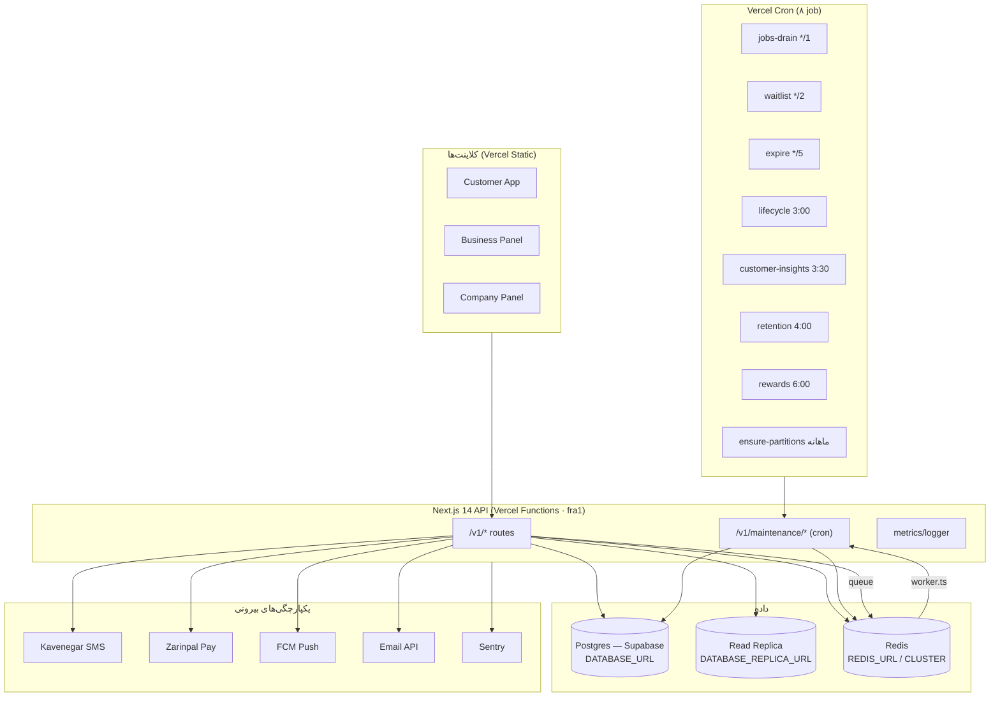

# RezervnoOS — Infrastructure Audit & Dependency Map (Step 1)

> این سند، **قبل از هر تغییری**، وضعیتِ واقعیِ زیرساخت را نقشه‌برداری می‌کند
> (طبق Step 1 برنامه‌ی Enterprise). یافته‌ی اصلی: RezervnoOS از قبل بخشِ بزرگی از
> چک‌لیستِ enterprise را **پیاده کرده**؛ این audit، موجود ↔ خواسته را تطبیق می‌دهد
> و شکاف‌های *واقعی* را جدا می‌کند تا هر PRِ بعدی هدفمند باشد.

تاریخ: ۲۰۲۶-۰۷ · وضعیت: audit (بدونِ تغییرِ کد)

---

## ۰) واقعیتِ استقرار — پیش از هر چیز

RezervnoOS **serverless روی Vercel** است، نه k8s/VM:
> ⚠️ **کهنه (تصحیحِ ۲۰۲۶-۰۸-۲۸):** سه بندِ زیر وضعیتِ امروز نیست. بک‌اند
> Next 16 است و به‌صورتِ کانتینرِ داکر پشتِ Caddy اجرا می‌شود (نه Vercel
> Functions)؛ سه پنل را همان Caddy سرو می‌کند؛ و زمان‌بندی از `cron/crontab`
> می‌آید (۹ job)، نه Vercel Cron. `api/vercel.json` حذف شد.

- ~~بک‌اند = Next.js 14 روی Vercel Functions (منطقه‌ی `fra1`).~~
- ~~سه فرانت‌اند = static روی Vercel (هر کدام پروژه‌ی جدا).~~
- ~~زمان‌بندی = **Vercel Cron** (۸ کران در `api/vercel.json`).~~

پیامدِ صادقانه برای چک‌لیست:
| خواسته‌ی enterprise | وضعیت روی Vercel |
|---|---|
| Horizontal scaling, Pod autoscaling, Rolling updates | **پلتفرم به‌صورت داخلی فراهم می‌کند** — نیازی به k8s نیست |
| Health/Readiness/Liveness/Startup probes | Vercel خودش مدیریت می‌کند؛ یک `/healthz` سبک کافی است |
| Graceful shutdown, Resource limits | مدلِ serverless (تابعِ کوتاه‌عمر) — عمدتاً N/A |
| Blue-Green / Canary | Vercel **Preview + Promote** = معادلِ native؛ k8s لازم نیست |
| Kubernetes manifests, Node affinity, PDB | **N/A** مگر مهاجرت به self-host |

> در `deploy/` فایل‌های **Caddy/nginx** و در `cron/` یک **Dockerfile+crontab** هست —
> یعنی یک مسیرِ *self-host اختیاری* از قبل طراحی شده. اگر روزی از Vercel مهاجرت شد،
> containerization (Step 5) و k8s (Step 6) آن‌جا معنا پیدا می‌کنند؛ **امروز نه.**

نتیجه: تمرکزِ کارِ واقعی روی **observability، security hardening، queue reliability،
DB optimization، environment/secret hygiene** است — نه بازآفرینیِ چیزی که Vercel می‌دهد.

---

## ۱) نقشه‌ی وابستگیِ زیرساخت

### ۱.۱ وابستگی‌های runtime (از `api/package.json`)
`@prisma/client`، `ioredis`، `jsonwebtoken`، `next`، `react`/`react-dom`.
سطحِ وابستگی **عامدانه کم** است (خوب برای cold-start و امنیت).

### ۱.۲ سرویس‌های runtime
| سرویس | مکانیزم | فایل |
|---|---|---|
| API | Vercel Functions | `api/src/app/api/v1/**` |
| Job queue + worker | Redis + drain cron | `lib/queue.ts`, `lib/worker.ts`, `maintenance/jobs-drain` |
| Cache | Redis + local | `lib/cache.ts`, `lib/availability-cache.ts` |
| Rate limit | Redis | `lib/ratelimit.ts` |
| Metrics | endpoint + token | `lib/metrics.ts` (`METRICS_TOKEN`) |
| Logging | structured | `lib/logger.ts` (`LOG_LEVEL`) |
| Audit | DB | `lib/audit.ts` → `AuditLog` |

### ۱.۳ یکپارچگی‌های بیرونی
Kavenegar (SMS، ۱۳ تمپلیت)، Zarinpal (پرداخت، sandbox flag)، FCM (push)،
Email API، Sentry (`SENTRY_DSN`).

### ۱.۴ تسک‌های پس‌زمینه / زمان‌بندی‌شده
۸ کرانِ Vercel (بالا) + صفِ Job که drain آن هر دقیقه اجرا می‌شود.

### ۱.۵ متغیرهای محیطی (۳۹ عدد — همه از `process.env`)
دسته‌ها: **راز** (JWT_SECRET/REFRESH، CRON_SECRET، MAINTENANCE_KEY، METRICS_TOKEN،
KAVENEGAR_API_KEY، ZARINPAL_MERCHANT_ID، EMAIL_API_KEY، FCM_SERVER_KEY، SENTRY_DSN)،
**اتصال** (DATABASE_URL، DATABASE_REPLICA_URL، REDIS_URL، REDIS_CLUSTER_NODES،
DB_CONNECTION_LIMIT، DB_POOL_TIMEOUT)، **رفتار** (NODE_ENV، LOG_LEVEL، OTP_DEV_MODE،
TRUST_PROXY_HEADERS، ALLOW_PRIVATE_WEBHOOKS، ZARINPAL_SANDBOX)، **پیکربندی**
(CUSTOMER_APP_URL، PLATFORM_ADMIN_TENANT_ID، ۱۳× KAVENEGAR_TPL_*).

---

## ۲) تطبیقِ چک‌لیستِ Enterprise ↔ وضعِ موجود

| Step | خواسته | موجود؟ | شاهد / شکاف |
|---|---|---|---|
| 2 Environments | جداسازیِ dev/qa/staging/prod/DR | ⚠️ جزئی | Vercel env (prod/preview) + `ENVIRONMENT.md`؛ **QA/DR رسمی نیست** |
| 3 Config mgmt | متمرکز، fail-fast validation | ⚠️ | `process.env` مستقیم؛ **schema-validated config loader ندارد** |
| 4 Secrets | rotation/audit/least-privilege | ⚠️ | Vercel env secrets؛ **rotation/versioning رسمی ندارد** |
| 5 Containerization | health/probes/graceful | ➖ N/A (Vercel) | `cron/Dockerfile` برای مسیرِ self-host موجود |
| 6 Kubernetes | HPA/rolling/canary | ➖ N/A (Vercel) | Vercel Preview→Promote معادل است |
| 7 CI/CD | lint/type/test/scan/deploy | ✅ عمدتاً | `.github/workflows` (design-system, test, e2e, security, build) |
| 8 Test automation | unit…chaos | ✅ خوب | `e2e/` (Playwright), `loadtest/` (k6 تا ۴۰۰k)؛ **chaos/soak ندارد** |
| 9 API Gateway | authz/ratelimit/versioning | ✅ | middleware + `with-restaurant-auth` + `ratelimit` + `/v1` versioning |
| 10 Background | queue-driven | ✅ | `queue.ts` + worker + drain cron |
| 11 Queue reliability | retry/DLQ/backoff/dedup | ⚠️ | `queue.ts` هست؛ **DLQ/priority/visibility-timeout باید تأیید/تکمیل شود** |
| 12 Cache | redis/local/stampede | ✅ عمدتاً | `cache.ts`, `availability-cache.ts`؛ **stampede-lock باید تأیید شود** |
| 13 DB optimization | index/pool/replica/partition | ✅ خوب | replica (`dbRead`), pooling env, `ensure-partitions` cron |
| 14 Observability | logs/trace/metrics/correlation | ⚠️ | `logger`+`metrics`+Sentry؛ **correlation/request-ID و distributed tracing کامل نیست** |
| 15 Monitoring | latency/queue/worker/KPI | ✅ عمدتاً | `observability/prometheus.yml` + Grafana |
| 16 Alerting | latency/failures/backlog | ✅ | `observability/alerts.yml` |
| 17 Security hardening | CSP/HSTS/CSRF/headers | ⚠️ | `SECURITY.md` + `lib/security.ts`؛ **باید نسبت به headers فعلی audit شود** |
| 18 Audit security | privileged actions | ✅ | `lib/audit.ts` → `AuditLog` (login/permission/config) |

راهنما: ✅ موجود · ⚠️ جزئی/نیازمندِ تکمیل · ➖ N/A روی Vercel

---

## ۳) شکاف‌های *واقعی* که ارزشِ PR دارند (اولویت‌بندی‌شده)

مرتب بر اساسِ نسبتِ ارزش/ریسک — هر کدام یک PRِ کوچک و افزایشی:

1. **Config loader با اعتبارسنجیِ fail-fast** (Step 3) — یک `lib/config.ts` که همه‌ی
   env را در بوت با schema می‌خواند و اگر متغیرِ لازم نبود، *صریح* می‌افتد (نه خطای
   مبهم در runtime). راز هرگز log نمی‌شود. **ریسک: پایین، سود: بالا.**
2. **Correlation/Request-ID سرتاسری** (Step 14) — یک middleware که `x-request-id`
   تولید/عبور می‌دهد و به logger و `platform_events` (از سندِ Intelligence) وصل می‌شود.
   پایه‌ی tracing. **ریسک: پایین.**
3. **Queue reliability audit + DLQ** (Step 11) — بررسیِ `queue.ts` برای retry/backoff،
   افزودنِ Dead-Letter صف و متریکِ عمقِ صف. **ریسک: متوسط.**
4. **Security headers hardening** (Step 17) — تأیید/افزودنِ CSP/HSTS/frame-options روی
   سه اپ و پاسخ‌های API (سازگار با استاتیک بودنِ فرانت‌اند). **ریسک: متوسط — نیازِ QA.**
5. **Secret rotation runbook + least-privilege review** (Step 4) — سند + چرخشِ کلیدها؛
   بیشتر عملیاتی تا کد. **ریسک: پایین.**
6. **DR/backup policy مکتوب** (Step 2, DR) — Supabase PITR + استراتژیِ restore مستند،
   یک drill. **ریسک: پایین (سند/پیکربندی).**

آیتم‌های N/A (Vercel): containerization و k8s — فقط اگر تصمیمِ مهاجرت به self-host
گرفته شد، از `deploy/` + `cron/Dockerfile` موجود شروع می‌شوند.

---

## ۴) توصیه‌ی توالی

هیچ‌کدام از این‌ها به بازنویسی نیاز ندارد؛ همه افزایشی‌اند. توالیِ پیشنهادی:
**config-loader → request-id → queue-DLQ → security-headers → secret/DR runbooks.**
هر کدام مستقل، قابلِ عقب‌گرد، و بدونِ شکستنِ API/UI.

> این audit عامدانه هیچ کدی تغییر نداد. قدمِ بعدی، انتخابِ *یک* شکاف از فهرستِ §۳
> و بازکردنِ یک PRِ کوچکِ هدفمند است.
