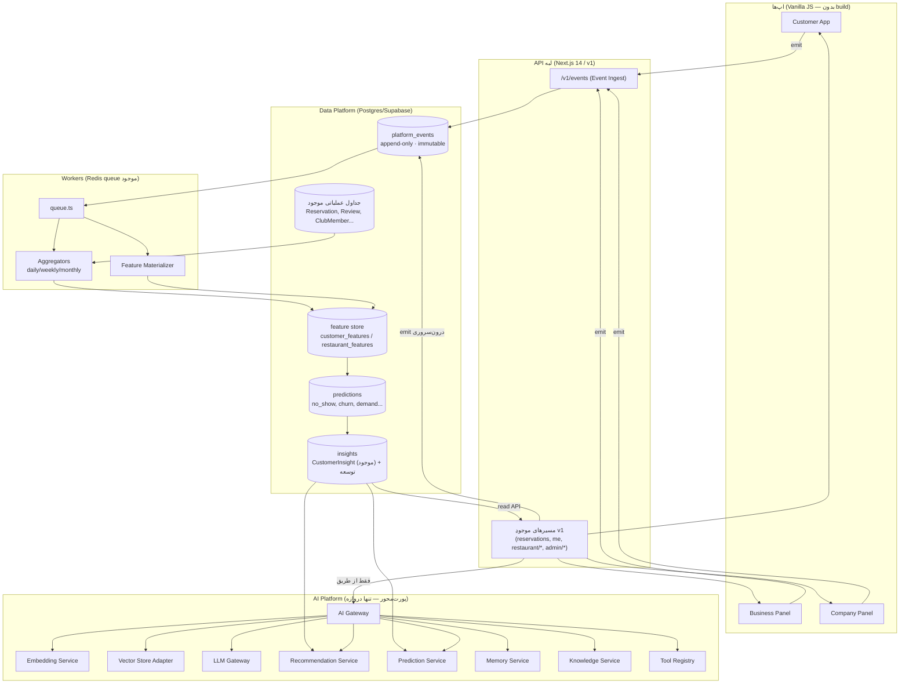
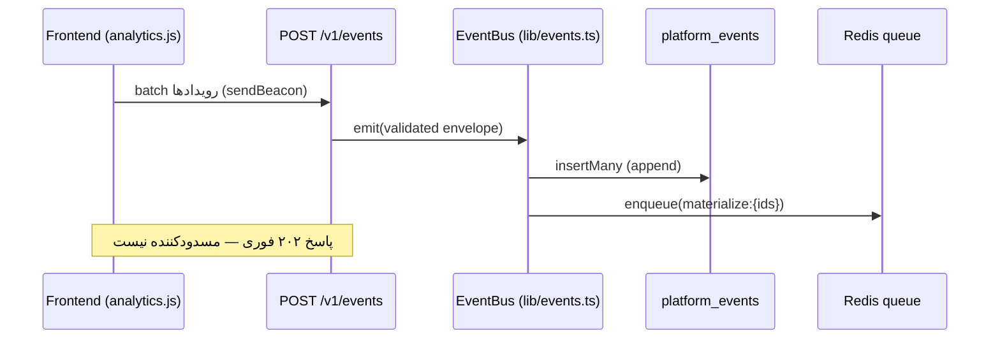
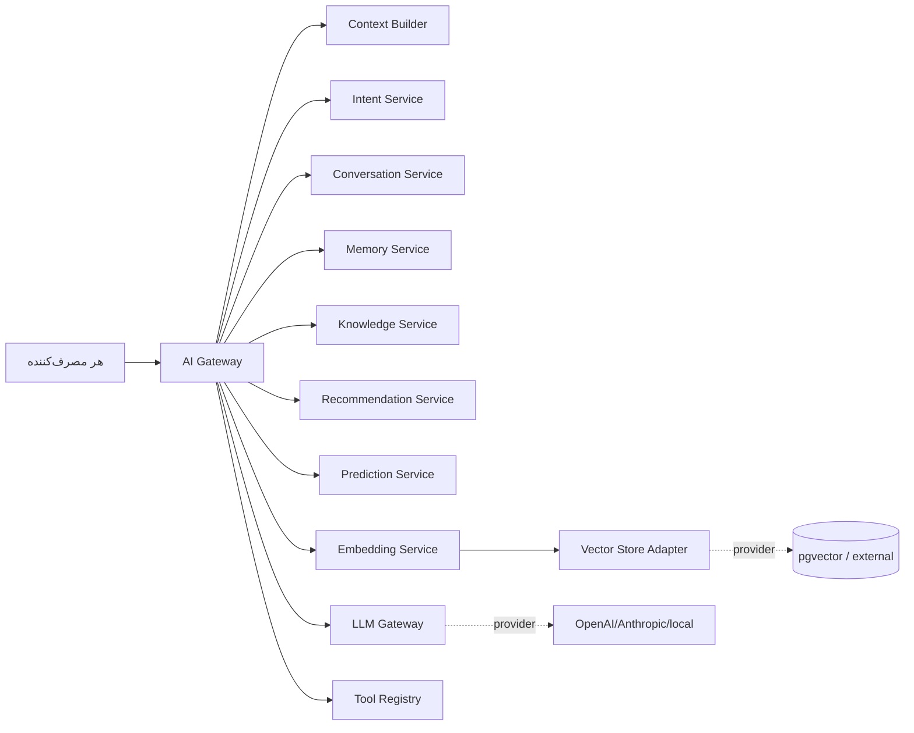

# RezervnoOS → Restaurant Intelligence Platform — نقشه‌ی معماری

> سند معماری (blueprint). هیچ کدِ اجراییِ این سند هنوز نوشته نشده؛ این نقشه‌ی
> راه است تا هر قابلیتِ هوشمندِ آینده **بدون بازنویسیِ پلتفرم** اضافه شود.
> اصلِ حاکم: **افزایشی (additive)، سازگارِ رو به عقب، بدون شکستنِ هیچ چیزِ موجود.**

نویسنده: تیم مهندسی · تاریخ: ۲۰۲۶-۰۷ · وضعیت: پیش‌نویسِ تأییدنشده

---

## ۰) خلاصه‌ی مدیریتی

RezervnoOS از قبل «نیمه-هوشمند» است: `CustomerInsight` (پروفایلِ CLV/RFM/churn)،
`restaurant/ai` (موتورِ تصمیمِ قانون‌محورِ شفاف)، `ReservationEvent` (رویدادِ
append-only)، `rfm`/`analytics`/`admin/business-intelligence`، و زیرساختِ
Redis + `queue.ts` + `Job` همین حالا در production کار می‌کنند.

پس این برنامه **بازنویسی نیست**؛ چهار شکافِ واقعی را افزایشی پر می‌کند:

1. **رویدادبوسِ فراگیر** — یک جدولِ `platform_events` تغییرناپذیر که رویدادهای
   همه‌ی دامنه‌ها (نه فقط رزرو) را از هر سه اپ جمع می‌کند.
2. **لایه‌ی فیچر/پیش‌بینیِ جداشده** — تفکیکِ خام → پردازش‌شده → فیچر → پیش‌بینی → بینش.
3. **AI Gateway** — تنها دروازه‌ی هر قابلیتِ LLM/embedding/vector (پورت‌محور،
   provider جایگزین‌پذیر). امروز خالی/rule-based، فردا ML بدونِ تغییرِ مصرف‌کننده.
4. **لایه‌ی حاکمیتِ داده** — consent، retention، جداسازیِ PII، ممیزیِ دسترسیِ AI.

هر چهار مورد **پشتِ سرویس** می‌نشینند؛ فرانت‌اندها فقط مصرف‌کننده‌اند و هیچ
منطقِ هوشمندی محلی حساب نمی‌کنند (سازگار با قانونِ موجودِ «backend = source of truth»).

---

## ۱) معماریِ کلان



**قاعده‌ی طلایی:** هیچ ماژولی مستقیم LLM/vector صدا نمی‌زند — همه از `AI Gateway`
عبور می‌کنند. و هیچ فرانت‌اندی BI محلی حساب نمی‌کند — همه از API می‌آید.

---

## ۲) Data Platform — منبعِ کانونیِ داده‌ی رفتاری

### ۲.۱ رویدادبوسِ تغییرناپذیر (`platform_events`)

مدلِ Prisma پیشنهادی (افزایشی — هیچ جدولِ موجودی تغییر نمی‌کند):

```prisma
model PlatformEvent {
  id            String   @id @default(uuid()) @db.Uuid
  // نوعِ رویداد به‌صورت رشته‌ی نام‌فضادار: "reservation.created", "search.performed"
  type          String
  occurredAt    DateTime @map("occurred_at")            // زمانِ وقوع (کلاینت/سرور)
  ingestedAt    DateTime @default(now()) @map("ingested_at")
  // زمینه‌ی چندمستأجری — همه اختیاری چون رویدادِ ناشناس هم داریم
  tenantId      String?  @map("tenant_id") @db.Uuid
  restaurantId  String?  @map("restaurant_id") @db.Uuid
  userId        String?  @map("user_id") @db.Uuid       // مشتری (اگر شناخته‌شده)
  staffId       String?  @map("staff_id") @db.Uuid
  sessionId     String?  @map("session_id")             // نشستِ ناشناس
  correlationId String?  @map("correlation_id")         // زنجیره‌ی علّی
  source        String                                  // customer|business|company|backend|cron
  device        Json?                                   // ua, platform, viewport
  geo           Json?                                   // اگر موجود بود
  payload       Json                                    // بدنه‌ی رویداد (schema-per-type)
  schemaVersion Int      @default(1) @map("schema_version")
  // بدونِ رابطه‌ی FK سخت به موجودیت‌ها → append بی‌قفل و سریع؛ join در تحلیل
  @@index([type, occurredAt])
  @@index([restaurantId, occurredAt])
  @@index([userId, occurredAt])
  @@index([correlationId])
  @@map("platform_events")
}
```

طراحی‌های کلیدی:
- **Append-only، هرگز UPDATE/DELETE** (به‌جز retention job). تاریخ بازنویسی نمی‌شود.
- **بدونِ FKِ سخت** به موجودیت‌ها → درج بی‌قفل، حذف نشدنی هنگام anonymize.
- **partitioning آینده** بر `occurredAt` (ماهانه) وقتی حجم بالا رفت — بدون تغییرِ API.
- در Supabase قابلیتِ **Row-Level-Security** برای جداسازیِ tenant.

### ۲.۲ قراردادِ رویداد (Event Envelope)

هر رویداد — از هر منبع — این پاکت را دارد:

```jsonc
{
  "type": "search.performed",
  "occurredAt": "2026-07-29T10:12:00Z",
  "source": "customer",
  "sessionId": "sess_...", "correlationId": "corr_...",
  "tenantId": null, "restaurantId": null, "userId": "usr_...",
  "device": { "ua": "...", "platform": "web" },
  "payload": { "query": "برگر", "results": 12, "filters": {"price":"$$"} },
  "schemaVersion": 1
}
```

فهرستِ اولیه‌ی `type`ها (نام‌فضادار، توسعه‌پذیر بدونِ migration چون رشته است):

```
reservation.created|cancelled|modified|completed|no_show
restaurant.viewed|shared     menu.viewed   dish.viewed
search.performed|result_clicked
favorite.added|removed        review.created|edited
foodDNA.modified              loyalty.enrolled|points_changed
notification.opened           promotion.viewed  campaign.clicked
customer.returned|inactive|reactivated
payment.initiated|succeeded|failed
feature.used                  support.message
```

---

## ۳) Event Collection — خطِ لوله



- **درون‌سروری:** یک helperِ `emit(event)` در `api/src/lib/events.ts` که مسیرهای
  موجود (مثلاً بعد از ساختِ رزرو) صدا می‌زنند — **بدونِ تغییرِ منطقِ موجود**،
  فقط یک خطِ `emit(...)` غیرمسدودکننده اضافه می‌شود.
- **کلاینت‌ها:** یک ماژولِ کوچکِ `analytics.js` (customer) / global (business/company)
  که رویدادها را batch و با `navigator.sendBeacon` می‌فرستد. اگر آفلاین → صف در
  `localStorage`. **دمومود دست‌نخورده** (رویداد اختیاری است، نبودِ بک‌اند نمی‌شکند).
- **immutability** فقط با **نبودِ endpointِ update/delete** تضمین می‌شود.
  ⚠️ اصلاحِ ۲۰۲۶-۰۹-۰۴ (P0-021): متنِ قبلی «RLSِ فقط-درج» را هم به‌عنوانِ ضامن
  می‌آورد. **چنین policyی وجود ندارد** — `029-platform-events.sql:39` فقط
  `ENABLE ROW LEVEL SECURITY` می‌زند و در کلِ مخزن صفر `CREATE POLICY` هست؛
  ضمناً اپ با نقشِ owner وصل می‌شود که RLS را دور می‌زند. پس RLS **هیچ** سهمی
  در immutability ندارد. اگر ضمانتِ سطحِ DB لازم است، مسیرش تریگرِ
  `BEFORE UPDATE OR DELETE … RAISE EXCEPTION` است یا policyِ واقعی + نقشِ
  غیرِowner + `FORCE ROW LEVEL SECURITY` (تیکتِ post-launchِ P0-022).

---

## ۴) Customer Intelligence Profile + حافظه‌ی بلندمدت

### ۴.۱ امروز (موجود)
`CustomerInsight` (کلید: restaurantId+userId) شاملِ CLV, RFM (r/f/m/segment),
churnRiskScore, noShowRate, visitFrequency, VIP — پروفایلِ زنده و به‌روزشونده.

### ۴.۲ شکاف و توسعه‌ی افزایشی
- **حافظه‌ی تاریخی/versioning:** `CustomerInsight` فقط «حالِ حاضر» را نگه می‌دارد.
  افزودنِ جدولِ append-only `customer_profile_snapshots` (نه بازنویسی — عکسِ روزانه/رویدادی):

```prisma
model CustomerProfileSnapshot {
  id           String   @id @default(uuid()) @db.Uuid
  restaurantId String   @map("restaurant_id") @db.Uuid
  userId       String   @map("user_id") @db.Uuid
  takenAt      DateTime @default(now()) @map("taken_at")
  features     Json     // عکسِ کاملِ فیچرها در آن لحظه
  version      Int      @default(1)
  @@index([restaurantId, userId, takenAt])
  @@map("customer_profile_snapshots")
}
```

- **پروفایلِ سراسری (cross-restaurant):** پرامپت «یک پروفایلِ یکپارچه» می‌خواهد.
  چون داده حساس و چندمستأجری است، پروفایلِ سراسری **مشتق** می‌شود (view/aggregate
  روی snapshotها) نه یک منبعِ جدید — تا مرزهای tenant و حاکمیت حفظ شود.
- **event replay:** چون `platform_events` تغییرناپذیر است، بازساختِ هر پروفایل در
  هر نقطه‌ی زمانی با replayِ رویدادها ممکن است (پایه‌ی تست و اصلاحِ مدل).

---

## ۵) Restaurant Intelligence Engine (قطعی، بدون LLM)

همه‌ی این‌ها **قطعی**‌اند و بیشترشان امروز در `analytics`/`rfm` هستند؛ کارِ افزایشی
= تجمیعِ آن‌ها در feature-store و پرکردنِ چند شکاف (dining duration, table
utilization, bottlenecks). خروجی در جدولِ `restaurant_features` (روزانه materialize).

```prisma
model RestaurantFeatureDaily {
  restaurantId String   @map("restaurant_id") @db.Uuid
  day          DateTime @db.Date
  features     Json     // peakHours, occupancy, cancelRate, noShowRate, returningRatio, clv, ...
  computedAt   DateTime @default(now()) @map("computed_at")
  @@id([restaurantId, day])
  @@map("restaurant_features_daily")
}
```

---

## ۶) Decision Support Engine (توسعه‌ی `restaurant/ai`)

موتورِ موجود عالی است ولی monolithic. بازآراییِ افزایشی به یک **Rule Registry**:

```ts
// api/src/lib/decisions/registry.ts
export interface Rule {
  id: string;
  evaluate(ctx: RestaurantContext): Promise<Card | null>; // null = صدق نکرد
}
export const RULES: Rule[] = [ winbackRule, noShowRule, turnoverRule, /* ... */ ];
// مسیرِ /restaurant/ai فقط RULES را map/filter می‌کند — خروجی بایت‌به‌بایت همان.
```

مزیت: هر قانونِ جدید = یک فایلِ کوچک، بدون دست‌زدن به بقیه. قطعی، قابل‌توضیح،
بدونِ hallucination — دقیقاً منطبق بر فلسفه‌ی فعلیِ کد.

---

## ۷) Recommendation & Prediction Engine (پورت‌محور)

هر دو پشتِ interface تعریف می‌شوند تا پیاده‌سازی از قانون → ML بدونِ تغییرِ مصرف‌کننده
عوض شود:

```ts
export interface Recommender<TIn, TOut> {
  recommend(input: TIn): Promise<Explained<TOut>[]>;   // هر نتیجه «چرا» دارد
}
export interface Predictor<TIn, TOut> {
  predict(input: TIn): Promise<{ value: TOut; confidence: number; basis: string }>;
}
```

- **امروز:** `RuleBasedNoShowPredictor` (از قبل `noShowRiskTier` داریم),
  `RfmRecommender`. **فردا:** `MlNoShowPredictor` — همان interface، صفر تغییرِ API.
- APIها: `/v1/intelligence/recommendations`, `/v1/intelligence/predictions/:kind`.

---

## ۸) AI Platform — تنها دروازه



- **پورت‌ها، نه پیاده‌سازی:** هر سرویس یک interface در `api/src/lib/ai/` است با یک
  پیاده‌سازیِ اولیه‌ی `noop`/`rule-based`. هیچ چیز امروز به LLM وصل نیست → هیچ
  ریسک/هزینه‌ای اضافه نمی‌شود، ولی نقطه‌ی اتصال آماده است.
- **LLM Gateway** تنها جایی است که کلیدِ provider را می‌بیند؛ بقیه از آن عبور می‌کنند.
- **Tool Registry** = فهرستِ سفیدِ toolهایی که LLM می‌تواند صدا بزند (کنترلِ دسترسی).

---

## ۹) Vector Architecture

- **provider جایگزین‌پذیر** پشتِ `VectorStoreAdapter`. پیش‌فرضِ پیشنهادی:
  **pgvector روی همان Supabase** (بدونِ سرویسِ جدید، بدونِ هزینه‌ی زیرساخت).
- embeddingها: customer / restaurant / review / menu / knowledge / conversation.
- جدولِ `embeddings(owner_type, owner_id, vector, model, dim, created_at)` — درج
  از طریق worker، خواندن فقط از `VectorStoreAdapter`.

---

## ۱۰) Knowledge Platform

مخازنِ دانش (restaurant/customer/business/support/operational/policy) به‌صورتِ
اسنادِ نسخه‌دار + embedding قابلِ جست‌وجوی معنایی. پیاده‌سازیِ اولیه: جدولِ
`knowledge_docs` + جست‌وجوی full-text (Postgres `tsvector`) امروز، semantic فردا.

---

## ۱۱) Data Governance (GDPR-ready)

| نگرانی | مکانیزم |
|---|---|
| Consent | جدولِ `consent_records(userId, scope, grantedAt, revokedAt)`؛ ingest بدونِ consentِ لازم فقط رویدادِ ناشناس نگه می‌دارد |
| Retention | job زمان‌بندی‌شده که `platform_events` قدیمی‌تر از N ماه را anonymize/partition-drop می‌کند |
| Anonymization | جداسازیِ `userId` از payload؛ hashِ برگشت‌ناپذیر برای تحلیلِ گروهی |
| Deletion (right to be forgotten) | tombstone + anonymize (نه شکستنِ append-only: `userId` را null و PII را می‌زداید) |
| PII isolation | PII فقط در جداولِ موجودِ عملیاتی؛ `platform_events.payload` بدونِ PII خام |
| Audit | توسعه‌ی `AuditLog` موجود به دسترسیِ AI/insight |

---

## ۱۲) لایه‌بندیِ داده (هرگز مخلوط نشود)

```
platform_events (خام, immutable)
      │  worker
      ▼
processed (جداول عملیاتی موجود + aggregates)
      │
      ▼
features (customer_features / restaurant_features_daily)
      │
      ▼
predictions (no_show / churn / demand)
      │
      ▼
insights (CustomerInsight + restaurant insights)
      │
      ▼
recommendations (Explained<T>)
```

هر لایه فقط از لایه‌ی پایین می‌خواند. فرانت‌اند فقط `insights`/`recommendations`
را می‌بیند.

---

## ۱۳) افزوده‌های API (همه افزایشی، نسخه‌ی v1)

```
POST /v1/events                      درج batch رویداد (202)
GET  /v1/intelligence/profile/:userId          (auth: restaurant/self)
GET  /v1/intelligence/recommendations           (توسعه‌ی restaurant/ai)
GET  /v1/intelligence/predictions/:kind
GET  /v1/intelligence/segments
GET  /v1/intelligence/analytics/:grain          (daily|weekly|monthly)
GET  /v1/intelligence/memory/:scope             (پشتِ AI Gateway)
GET  /v1/intelligence/knowledge/search
```

هیچ‌کدام مسیرِ موجود را تغییر نمی‌دهند؛ فقط اضافه می‌شوند.

---

## ۱۴) یکپارچگیِ فرانت‌اند

- **افزودن:** یک ماژولِ سبکِ `analytics` (customer: ES module؛ business/company: global)
  که فقط رویداد emit می‌کند. با `sw.js` (فقط customer) → bumpِ `CACHE_VERSION`.
- **مصرف:** هرجا امروز BI محلی حساب می‌شود (پنلِ بیزنس دموداده دارد)، تدریجاً با
  فراخوانِ `/v1/intelligence/*` جایگزین می‌شود — **بدونِ تغییرِ UI**، فقط منبعِ داده.
- **دمومود حفظ می‌شود:** نبودِ بک‌اند → analytics بی‌صدا no-op، UI مثل امروز کار می‌کند.

---

## ۱۵) نقشه‌ی مهاجرت (فازبندی — هر فاز یک PRِ کوچک و امن)

| فاز | محتوا | ریسک | گیت |
|---|---|---|---|
| **P0** | همین سند (blueprint) | صفر | review |
| **P1** | مدلِ `platform_events` + `lib/events.ts` (emit) + `POST /v1/events` + SQL افزایشی | پایین (فقط جدولِ جدید) | PR + tsc + tests |
| **P2** | `analytics.js` در سه اپ (emit فقط) + bump cache | پایین | PR + QA دستی |
| **P3** | Worker: aggregator + `restaurant_features_daily` | پایین | PR |
| **P4** | Decision Rule Registry (بازآراییِ `restaurant/ai`، خروجیِ بایت‌به‌بایت) | متوسط | PR + snapshot test |
| **P5** | `Recommender`/`Predictor` interfaceها + APIهای intelligence | متوسط | PR |
| **P6** | AI Gateway پورت‌ها (noop) + Governance (consent/retention) | متوسط | PR |
| **P7** | pgvector + Embedding/Vector adapter + Knowledge | بالا (DB extension) | PR + review |
| **P8** | جایگزینیِ تدریجیِ ruleها با ML پشتِ همان interfaceها | — | آینده |

**هیچ فازی به فازِ بعد وابسته نیست برای کارکردنِ محصول** — هرکدام مستقل ارزش می‌دهد
و مستقل قابلِ عقب‌گرد است.

---

## ۱۶) بدهیِ فنیِ حذف‌شده / کاهش‌یافته

- تجمیعِ منطقِ BIِ پراکنده (`rfm`, `analytics`, `business-intelligence`) پشتِ یک
  feature-store → حذفِ محاسبه‌ی تکراری.
- حذفِ BIِ محلیِ فرانت‌اند → یک منبعِ حقیقت.
- شکافِ شناخته‌شده‌ی `Tenant.version` در `0_init` (seed P2022) در فازِ P1 همراهِ
  migration پاک می‌شود.

---

## ۱۷) آمادگیِ AIِ آینده — چرا این معماری «بدونِ بازنویسی» توسعه می‌یابد

1. **رویدادِ تغییرناپذیر** = هر مدلِ آینده روی همان داده‌ی تاریخی train/replay می‌شود.
2. **پورت‌محوری** = rule→ML فقط تعویضِ یک پیاده‌سازیِ interface است.
3. **AI Gateway تنها دروازه** = افزودنِ provider/مدل بدونِ لمسِ مصرف‌کننده‌ها.
4. **لایه‌بندیِ سخت** = افزودنِ لایه‌ی جدید (مثلاً feature جدید) بدونِ شکستنِ بالادست.
5. **افزایشی بودن** = هر قدم مستقل، قابلِ عقب‌گرد، سازگارِ رو به عقب.

---

## ۱۸) معیارِ موفقیت (قابلِ سنجش)

- [ ] هر تعاملِ مشتری یک رویداد در `platform_events` ثبت می‌کند (نرخِ پوشش > ۹۰٪).
- [ ] هر رستوران بینشِ عملیاتی از feature-store می‌گیرد (نه محاسبه‌ی محلی).
- [ ] افزودنِ یک قابلیتِ AIِ جدید = یک PRِ افزایشی بدونِ تغییرِ مصرف‌کننده‌ی موجود.
- [ ] `platform_events` منبعِ کانونیِ رفتار است.
- [ ] هر مسیرِ LLM/vector از `AI Gateway` عبور می‌کند (صفر فراخوانِ مستقیم).
- [ ] همه‌ی کارکردهای فعلیِ Customer/Business/Company دست‌نخورده کار می‌کنند.
