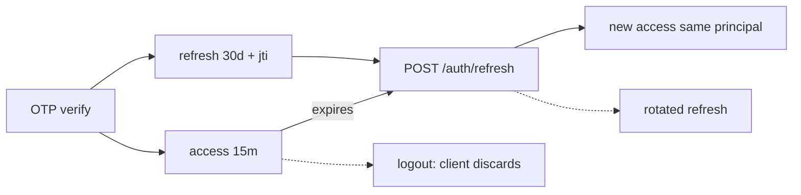

# SECURITY.md — RezervoNo

> Security model as implemented in `api/` (middleware + `lib/`). This reflects
> the code today; treat "Recommendations" as forward-looking.

> **Status (Aug 2026):** production-hardening audits in PR #13 and PR #16
> (both merged) closed the P0 booking/security set identified in the Aug 2026
> review — see §11. This is a snapshot of what's mitigated today, not a claim
> that the system is "fully hardened forever"; see
> [KNOWN_LIMITATIONS.md](./KNOWN_LIMITATIONS.md) for what remains open.

---

## 1. Authentication

- **Stateless JWT** (`jsonwebtoken`), **HS256** explicitly (blocks `alg:none` /
  algorithm-confusion), with `issuer='rezervno'` and `audience='rezervno-api'`.
- **Separate secrets** for access and refresh; both must be **≥ 32 chars**
  (fail-fast in `jwt.ts`).
- **Access** token: 15 min. **Refresh**: 30 days, contains a `jti` and the full
  principal (`kind` + `tenantId`/`role` for staff) so a refresh re-issues a
  same-kind access token.
- **OTP** (`lib/otp.ts`): 6-digit code, `sha256(code + JWT_SECRET)` stored in
  `otp_codes`, 2-minute TTL, **max 5 verify attempts**, constant-time comparison
  (`timingSafeEqual`). Phone normalized to `+98…`. `OTP_DEV_MODE=true` is
  **rejected in production** (would leak the code → auth bypass).
- Three principals: **customer**, **staff** (`owner`/`manager`/`staff`),
  **platform-admin** (staff `owner` of `PLATFORM_ADMIN_TENANT_ID`, fail-closed).

---

## 2. Authorization

- **Role gate**: `owner`/`manager` bypass fine-grained checks.
- **Modular RBAC** (`StaffPermission`) for `role='staff'` with safe defaults
  (day-to-day ops only; analytics/revenue/settings off by default).
  `requirePermission` looks up the **acting** staff by `auth.sub` (a prior bug
  used `findFirst` by tenant → privilege leakage; fixed).
- **Tenant isolation**: restaurant-scoped routes resolve the staff's restaurant
  and scope every query to `restaurantId`/`tenantId`. Cross-tenant access →
  `FORBIDDEN_TENANT`.
- **Platform admin fail-closed**: if `PLATFORM_ADMIN_TENANT_ID` is unset, admin
  routes deny everyone (previously they would have let any restaurant owner in).

---

## 3. Token Lifecycle

- Refresh preserves principal (kind/tenant/role).
- **Refresh revocation is implemented and verified (Aug 2026).** `POST
  /auth/logout` revokes the refresh token's `jti`
  (`revokeRefreshToken`/`isRefreshRevoked` in `lib/security.ts`); `POST
  /auth/refresh` checks the denylist on every call and re-reads
  `Staff.isActive`/user ban status **live from the DB** (not from the refresh
  token's own payload), revoking and rejecting immediately if the account is
  now disabled or banned.
- **No access-token denylist exists.** An already-issued access token stays
  valid for its own TTL (15 min) after logout/deactivation/ban — a bounded,
  accepted residual (see §12), not an open bug.

---

## 4. Session Handling

- **No cookies / no server sessions** for the API — Bearer tokens only. This is
  the primary CSRF mitigation.
- Front-ends store tokens in `localStorage` (`rz_access`/`rz_refresh`) and auto-
  refresh on 401. (Trade-off: `localStorage` is readable by JS, so XSS
  discipline matters — see below.)

---

## 5. CSRF

- Bearer-token auth (no ambient cookies) makes the API CSRF-resistant by design.
- **Defense-in-depth**: `middleware.ts` checks the `Origin` header on mutating
  methods (`POST/PUT/PATCH/DELETE`) against `ALLOWED_ORIGINS`; a bad origin →
  `403` + violation recorded. Requires `ALLOWED_ORIGINS` set in production
  (fail-fast otherwise).

---

## 6. XSS

- API responses are JSON with `Content-Security-Policy: default-src 'none';
  frame-ancestors 'none'`, `X-Content-Type-Options: nosniff`,
  `X-Frame-Options: DENY`, `Referrer-Policy: strict-origin-when-cross-origin`,
  and `Permissions-Policy` disabling geolocation/camera/mic/payment on the API
  origin.
- **Front-end** renders HTML template strings; user-controlled text is escaped
  via an `esc()` helper before interpolation (`shared/js/format.js` — the
  single canonical implementation for all three panels; unit-tested since PR
  #16, `api/tests/esc.test.mts`). **(recommendation)** a full audit of every
  `innerHTML` sink to confirm all external/user data actually passes through
  `esc()` has not been completed end-to-end — see §12.
- **HSTS**: `Strict-Transport-Security: max-age=63072000; includeSubDomains;
  preload`.

---

## 7. SQL Injection Protection

- **Prisma** parameterizes all model queries.
- **Raw SQL** uses `Prisma.sql` / tagged `$queryRaw` with **parameterized**
  fragments (e.g. the active-status set is built with `Prisma.join([...Prisma.sql])`,
  not string concatenation) — this specifically fixed an earlier incomplete
  status list.
- Input is validated by the Zod-like schemas before reaching queries.

---

## 8. Rate Limiting & Abuse Protection

- **Sliding-window log** in Redis (sorted sets), atomic via `MULTI`
  (`lib/ratelimit.ts`).
- **Layers**: global per-IP (middleware) + per-route rules (`RULES`):
  - OTP request: 3/10m per phone, 15/10m per IP; OTP verify: 8/10m per IP.
  - reservations: 10/min; search: 60/min; auth: 20/min; global: 120/min per IP.
- **Auto-ban**: ≥ 10 rate-limit violations in 5 min → IP banned for 1 hour.
- **Fail-open with a floor**: if Redis is down, both the global middleware
  path and every route-level `enforceRateLimit` call fall back to an
  **in-memory** per-process limiter (a DDoS floor, not full protection)
  rather than removing all limits or 500ing. Both paths share one
  implementation, `rateLimitWithFallback` (`lib/ratelimit.ts`) — until
  residual-hardening (Aug 2026), only the middleware path actually had this
  fallback; route-level calls threw uncaught on a Redis outage. **Now
  observable**: every fallback emits `rezervno_rate_limit_fallback_total`
  (labels `prefix`, `scope`) and a structured warn log; auto-bans emit
  `rezervno_rate_limit_auto_ban_total`; a failed ban-check (fail-open, ban
  not enforced) emits `rezervno_ban_check_fail_open_total`. **Alerting wired,
  round-20 (2026-09-04)**: `observability/alerts.yml` (`rezervno_security`
  group) now has `RateLimitRedisFailOpen`, `BanCheckFailOpen` and
  `RateLimitAutoBanSpike`, proven able to fire with `promtool test rules`
  (`observability/alerts.test.yml`, both a silent-blip series and a
  sustained/clustered series per rule). What this does **not** prove: that a
  human actually gets paged. No Alertmanager (or a Grafana notification
  channel) is deployed anywhere in this repo —
  `docker-compose.observability.yml` runs only `prometheus` + `grafana`, and
  neither has a configured receiver. Today a firing rule is visible in
  Prometheus's own `/alerts` page and in Grafana if someone looks; nothing
  pushes it to a person. That gap predates this rule set (all 13 prior rules
  have the same limitation) and needs a founder-chosen notification channel
  and credentials before "alerting" is actually true end-to-end. The related
  reservation-lock fail-open counter, `rezervno_slot_lock_fallback_total`
  (`lib/redis.ts:166`), remains unwired — out of round-20's scope, tracked
  as a follow-up (see §12.5).
- **Client IP** is derived safely (prefers `X-Real-IP`/`CF-Connecting-IP`, else
  the **right-most** `XFF` hop) to prevent spoofing (`TRUST_PROXY_HEADERS` gates
  this).

---

## 9. Secrets Management

- No secrets in git; only `.env.example` placeholders. `.env` is git-ignored.
- Fail-fast validation of critical secrets (JWT length, `ALLOWED_ORIGINS`).
- Self-host: Redis/Postgres require passwords even on the internal network
  (defense against lateral movement). Containers run **non-root**.
- Runtime provider secrets can live in `platform_settings` (DB), editable from
  the company panel, with env fallback.

---

## 10. Other Controls

- **SSRF guard**: outbound webhooks reject private/internal addresses unless
  `ALLOW_PRIVATE_WEBHOOKS=true` (dev only); webhooks are HMAC-signable.
- **Idempotency**: `Idempotency-Key` on reservation POST prevents double-charge/
  double-book on retries.
- **Audit log**: security/governance events persisted to `audit_logs`
  (auth failures, permission changes) with trace ids.
- **Dependency audit** in CI: `npm audit --audit-level=critical` **fails** the
  build; `high` warns.
- **CI secrets**: E2E mocks the API entirely (no real backend/secrets in E2E).
- 🚫 **Row-Level Security is NOT a control today (P0-021, verified 2026-09-04).**
  RLS is **enabled on 61 of 73 `public` tables with ZERO policies**, and the API
  connects as the database **owner** role (locally verified: `rezervno super=true
  bypassrls=true`), with `FORCE ROW LEVEL SECURITY` set on **no** table. Therefore
  **RLS provides no tenant isolation today** - it hides nothing from anyone. The
  tenant boundary is **application-layer** (`ctx.restaurant.id` / `auth.tenantId`)
  and is verified by the A5 isolation matrix.
  Never cite “RLS is enabled” as isolation evidence in a report, checklist or
  launch gate. The guard `api/tests/rls-policy-honesty.integration.test.mts`
  fails on any table that is RLS-enabled with zero policies outside its
  documented allowlist, and on any policy that lacks `FORCE ROW LEVEL SECURITY`.

---

## 11. Booking & Reservation Integrity (hardened, Aug 2026)

Production-hardening audits (PR #13, PR #16 — both merged) closed a set of
booking-domain P0s identified in an Aug 2026 review. As implemented on `main`
today:

- **Reservation lifecycle.** All status transitions (arrival check-in, hold
  expiry, late no-show) go through `transitionReservation`
  (`lib/lifecycle.ts`) — the single writer of `reservation.status` — instead
  of direct or bulk `UPDATE`s. Every transition produces an audit event
  (`reservation_events`); an invalid transition is rejected with a structured
  `422 INVALID_STATUS_TRANSITION`, not a silent write or a raw `500`.
- **Merge / secondary-table occupancy.** Postgres's `no_table_overlap` EXCLUDE
  constraint only covers a reservation's primary `table_id`. Secondary tables
  in a merged reservation (`merged_table_numbers`) are additionally checked at
  the application layer (`lib/table-occupancy.ts`,
  `getOccupiedTableNumbers`) — re-run **inside** the same `Serializable`
  transaction, immediately before insert, not just once before entering it —
  before any new reservation — direct or via the merge-fallback path — can
  claim them. **Proven live (residual-hardening, Aug 2026):** two genuinely
  simultaneous requests contending for the same secondary table (via
  `Promise.all` against real Postgres, not sequential/mocked) were run
  repeatedly; `Serializable` isolation plus this in-transaction re-check
  correctly let exactly one succeed every time, the other getting a
  structured `409`-family error — this is now a permanent test
  (`table-merge-occupancy-concurrency.test.mts`), not a one-off claim. This
  is still an application-layer check, not a second DB-level constraint: a
  narrower TOCTOU window than what was tested remains theoretically possible
  (documented in the module itself), unlike the DB-enforced guarantee the
  EXCLUDE constraint gives the primary table.
- **Preorder tenant scoping.** Preorder `menuItemId`s are filtered by
  `restaurantId`; a count mismatch (a missing or cross-tenant id) is rejected
  with a validation error instead of silently pricing the item at 0 or
  charging another restaurant's price.
- **Waitlist guest IDOR.** A guest (unauthenticated) waitlist entry requires a
  high-entropy `guestAccessToken`, issued once at join time and returned only
  to the joining client. The server stores just its hash
  (`guest_access_token_hash`, `sha256(token + JWT_SECRET)` — the same pattern
  as `otp_codes.code_hash`, §1) and compares with `timingSafeEqual`; a
  missing or wrong token gets a not-found-shaped error (no existence leak).
  Authenticated-customer entries instead require an exact caller/owner match.
- **Hard ban coverage.** `assertUserNotBanned` is enforced on reservation
  create, waitlist join, mission claim, reward redeem, and review create — the
  customer-facing mutations identified as gaps in the Aug 2026 audit.
- **Walk-in / manual table assignment.** Rejects a table in `maintenance`
  state or marked inactive; a genuine concurrent conflict (the EXCLUDE
  constraint firing) is mapped to `409 TABLE_CONFLICT`, not an opaque `500`.
- **Time-range contract, formalized (Time-Range/EXCLUDE/Redis-evidence audit,
  Aug 2026).** `computeRanges` (`lib/reservation-helpers.ts`) is the single
  source of truth for `slot_start → slot_end → block_buffer_minutes →
  block_end` (the generated column the EXCLUDE constraint and
  `getOccupiedTableNumbers` both key off). Auditing every write path found one
  real drift: `createWalkin` never set `block_buffer_minutes` (column default
  `0`), so a walk-in's block ended exactly at `slot_end` — no cleaning/buffer
  time — unlike every online/manual booking, which always gets
  `cleaningMinutes + bufferMinutes`. Fixed to apply the same formula. The
  active-status list used by the `no_table_overlap` EXCLUDE `WHERE` clause
  (`prisma/sql/026-consolidate-exclusion-constraint.sql`) was re-verified
  against `ACTIVE_RESERVATION_STATUSES` and found in parity; a unit test now
  parses `026`'s SQL text directly (not a hand-copied array) so future drift
  fails CI, not just a future audit.
- **Redis slot-lock fail-open (Time-Range/EXCLUDE/Redis-evidence audit, Aug
  2026).** `withSlotLock` (`lib/redis.ts`) — the Redis lock `createReservation`
  takes before writing — previously had no fallback for Redis being
  *unreachable* (only for the lock being genuinely held). A real Redis outage
  threw an uncaught `ioredis` error out of `createReservation`, which
  `errorResponse` turned into a generic `500` — contradicting the documented
  architecture (the lock is purely a contention-reducing optimization; DB
  `EXCLUDE` + `Serializable` + the in-transaction occupancy re-check is the
  source of truth). Fixed: a connection-level failure on lock *acquisition*
  now fail-opens (proceeds without a lock, `rezervno_slot_lock_fallback_total`
  metric + a warning log), and a failure *releasing* the lock afterward no
  longer masks a successful reservation behind a spurious `500` (the lock's
  own TTL expires it either way). **Proven live:** the same dual-concurrent
  `Promise.all` methodology used for the merge-occupancy case above was
  re-run with the lock forced into this exact fail-open path (via the same
  dependency-injection pattern already used for the no-show predictor,
  not a real downed Redis) — direct-table and merge bookings both still
  produced exactly one winner and one structured `409`-family loser, never a
  `500`. This also surfaced a second, adjacent gap: under genuine simultaneous
  contention (only reliably reachable *without* the lock damping it), Postgres
  sometimes reports the exclusion conflict as a
  `PrismaClientUnknownRequestError` (SQLSTATE only in the message text) rather
  than the `PrismaClientKnownRequestError` shape `isConflictError`/
  `isSerializationError` previously recognized — also fixed, with the exact
  failure shape captured as a regression test.

Verified via `api/tests/*.test.mts` (incl. real-Postgres integration tests for
the merge-occupancy case — both a sequential one,
`table-merge-occupancy.test.mts`, PR #16, and two genuinely concurrent ones,
`table-merge-occupancy-concurrency.test.mts` — with Redis lock available
(residual-hardening) and with it forced fail-open (Time-Range/EXCLUDE/Redis-
evidence audit) — plus `redis.test.mts` for `withSlotLock` in isolation and
`reservation-status.test.mts` for EXCLUDE status-list parity) — see
[KNOWN_LIMITATIONS.md](./KNOWN_LIMITATIONS.md) for what's still open. Payment
idempotency (P0-9) remains code-reviewed/unit-tested only — it needs a real
Zarinpal `merchant_id`, not available in this environment.

## 12. Security Recommendations (forward-looking)

1. **Access-token denylist.** None exists today — only refresh tokens are
   revocable (via `jti`). The 15-minute residual access-token window after
   logout/deactivation/ban (§3) is an accepted trade-off; revisit only if a
   specific incident needs a shorter window.
2. **XSS sink audit — automated and passing (residual-hardening, Aug 2026).**
   `tools/xss-sink-audit.mjs` scans every `innerHTML`/`insertAdjacentHTML`/
   `document.write`/`eval` call under `apps/customer|business|company` +
   `shared/js` and fails on any unescaped one; currently zero. It's heuristic
   (regex, not real dataflow) and **not wired into CI yet** — re-run it by
   hand after touching front-end render code, and consider adding it as a
   non-blocking (then blocking) CI job. Consider moving tokens from
   `localStorage` to memory + refresh-cookie if a stronger XSS posture is
   needed.
3. **Rotate secrets** regularly; ensure `CRON_SECRET`/`MAINTENANCE_KEY` are set
   in every environment (cron endpoints must never be public).
4. **Make RLS real, or keep calling it inert (P0-021).** Today RLS is enabled on
   61/73 tables with **zero policies** and the app connects as **owner**, so it is
   inert - see §10. Real defense-in-depth needs all three of: a **non-owner**
   application role, **actual policies**, and **`FORCE ROW LEVEL SECURITY`**;
   any one of them missing and the other two protect nothing. Scoped as a
   **post-launch** ticket (P0-022) because switching the app off the owner role
   pre-launch risks breaking every query. (The old wording said “extend RLS,
   started in `manual/023`” - the path `prisma/migrations/manual/` no longer
   exists; the scripts live in `api/prisma/sql/`, and `037` already extended RLS
   to the 34 core tables.)
5. **Alerting on the rate-limit fail-open path and auto-bans — rules exist,
   round-20 (2026-09-04)** (`RateLimitRedisFailOpen`, `BanCheckFailOpen`,
   `RateLimitAutoBanSpike` in `observability/alerts.yml`, proven with
   `promtool test rules`; see §8). **Delivery is not wired**: no Alertmanager
   or Grafana notification channel exists in this repo, so nothing pages a
   human yet — a founder decision on notification channel + credentials is
   still needed. The reservation slot-lock fail-open path
   (`rezervno_slot_lock_fallback_total`, §11, `lib/redis.ts:166`) is still
   completely unwired — it was out of round-20's scope and remains
   log-only.
6. **Pen-test the payment callback** (`/payments/callback`) — it is
   intentionally unauthenticated and relies on `authority + code + amount`
   matching; confirm amount/authority binding is strict. Payment idempotency
   (superseding a stale pending authority) is code-reviewed and unit-tested
   but not exercised against a real Zarinpal `merchant_id`.
